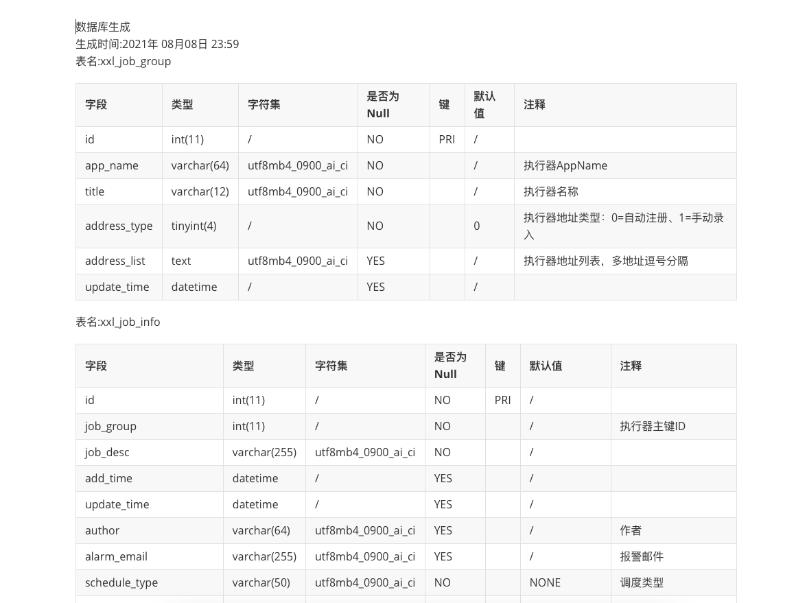

# tool-db-doc
数据文档生产工具

## 代码结构说明

// TODO

## 使用
```plain text
# 打包
mvn clean package

# 运行
java -jar facade-rest.jar -Ddb.property=<DB配置文件路径>

# http请求生成DB Doc
GET http://<host>:8080/db/file/md


```

## Feature:
1.支持http请求下载db的说明文档

2.支持MySQL数据库

3.支持Markdown格式文件输出

## TODO
1.支持GUI

2.支持其他数据库

3.支持pdf，word格式文件输出

## Example



